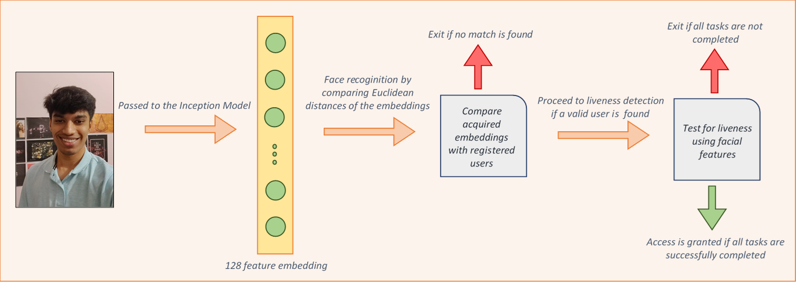

# FACE VERIFICATION WITH LIVENESS DETECTION

 Many developments have taken place in the field of face-recognition and liveness analysis to improvise various
device securities and attendance verification systems. Many
approaches have incorporated 3D analysis of the face to predict
the liveness of the person in front of it. Our method of analysis
tries to account for this problem without using advanced 3D
imaging techniques or hardware. It consists of two parts, the
former helps in face verification and the latter to check the
liveness of the face in front of it. In the first part, we have used
a model based on Google’s FaceNet (Inception) Model which
learns a mapping from face images to compact Euclidean space
distances, which directly correspond to the measure of similarity
of the images. Once the space has been produced, face
verification can be easily implemented using standard
techniques with embeddings as feature vectors. For the second
part, we have employed a cascaded multi-task framework that
extracts certain features from the facial image which are then
used to check for liveness by tracking their relative
displacements. In this case, Multi-Task Cascaded Convolutional
Network (MTCNN) has been used. These extracted features
were used to check the liveness of the person’s face by asking
them to perform some tasks in a random order like moving their
head towards right or smile etc. 

## Testing Video

